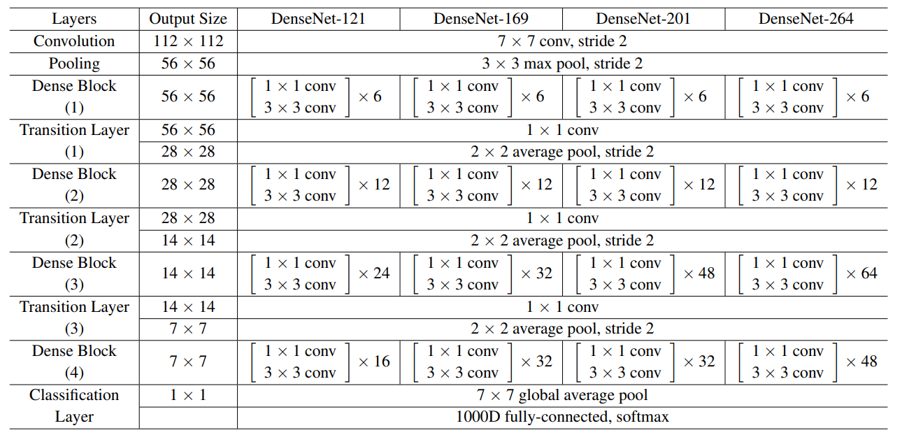

# DenseNet-Implementation

"Densely Connected Convolutional Networks" by Gao Huang, Zhuang Liu, Laurens van der Maaten and Kilian Q. Weinberger.

Paper: https://arxiv.org/pdf/1608.06993.pdf

## Architecture



## What about training?

No GPU, No Training.

## Info

Run script below to checkout the model informations

```sh
python info.py
```

## Usage

Before running the script, place your data directory location for both train and test data in `root_dir="{DIR}"` here at [dataloader.py](./dataloader/dataloader.py) or datasets from [torchvision.datasets](https://pytorch.org/vision/0.8/datasets.html)

```sh
python train.py --epochs 100 --num_layers 121 --num_classes 1000
```